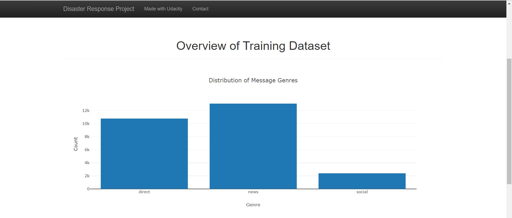
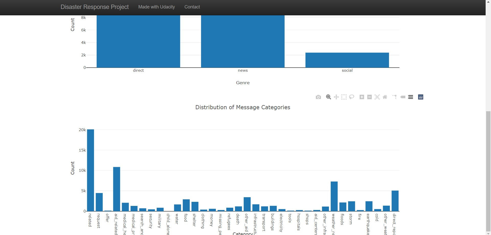

# Disaster Response Pipeline Project

## Project Overview
This repository designs a web app which an emergency operators could exploit during a disaster, to classify a disaster text messages into 36 categories which then can be forwarded to respective responsible departments
The app uses a machine learning based classifier to classify the messages.

## Installation
This repository was written in HTML and Python , and requires the following Python packages:
 pandas, numpy, re, pickle, nltk, flask, json, plotly, sklearn, sqlalchemy, sys,  warnings.

## Instructions to run:
1. Run the following commands in the project's root directory to set up your database and model.

    - To run ETL pipeline that cleans data and stores in database
        ```shell
        python data/process_data.py data/disaster_messages.csv data/disaster_categories.csv data/DisasterResponse.db
        ```
    - To run ML pipeline that trains classifier and saves
        ```shell
        python models/train_classifier.py data/DisasterResponse.db models/classifier.pkl
        ```

2. Run the following command in the app's directory to run your web app.
    ```shell
    python run.py`

3. Go to http://0.0.0.0:3001/
## File Structure
```
.
├── app
|   └── temlates
|   |       └── go.html                 # html template
|   |       └── master.html             # html master template
|   └── run.py                          # program to host the website
├── assets                              # screenshots
|    └── search.JPG
|    └── viz1.JPG
|    └── viz2.jpg
├── data               
│   └── disaster_categories.csv         # csv file containing target features
|   └── disaster_messages.csv           # csv file containing features
|   └── DisasterResponse.db             # database created from ETL Pipeline
|   └── process_data.py                 # ETL pipeline script
├── models
│   └── best_adab.pkl                   # pickle file for best classifier
|   └── train_classifier.py             # ML pipeline script
|── ETL Pipeline Preparation.py         # ETL pipeline Preparation notebook
|── ml_pipeline.py                      # ML pipeline Preparation notebook
└── README.md
```
## Screenshots

*** Database information ***



***Search Page***


## Licensing, Authors, Acknowledgements
This app was completed as part of the [Udacity Data Scientist Nanodegree](https://www.udacity.com/course/data-scientist-nanodegree--nd025).
